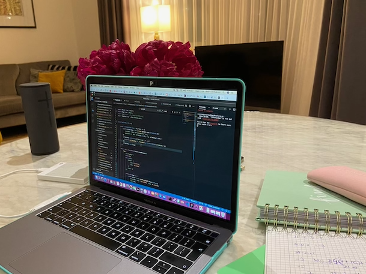

Today I worked on my Personal portfolio website and on the Treatwell page replica

Every day I add a coding log here, just like this one, and looking at it every day, I realized I didn't like the way my log layout looked. It didn't say 'log', it looked more like a regular, boring page.

So this is what I did in the first part of my day, after reading a couple of Medium articles. I redesigned my log. I added a lighter color and I split it in two columns. The obvious choice for the right column would be to add a most recent logs section but I haven't decided yet.

After that, I started working on the Map component of the Treatwell page replica. I added the logic for on map load displaying all the salons in a certain area but unfortunately I couldn't test it since the Google Maps API requires billing details to show these, diferent from the markers display which works, apart from the fact that the map is very dark.

I also worked a little on the salon cards component. I added some more content and I styled it further. I have a lot of work to do there since instead of a simple image, it contains a carousel.

Happy coding!

