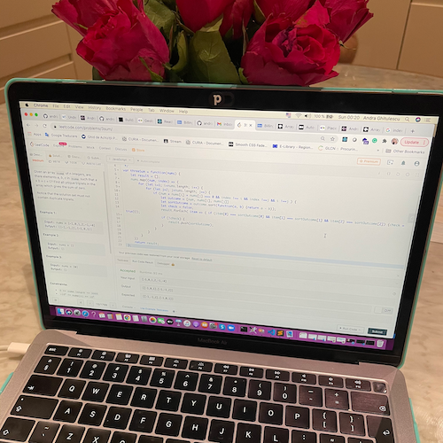

Family day today so just one coding challenge from LeetCode

 Given an array nums of n integers, are there elements a, b, c in nums such that a + b + c = 0? Find all unique triplets in the array which gives the sum of zero.

The solution set must not contain duplicate triplets.

Example 1:

Input: nums = [-1,0,1,2,-1,-4]

Output: [[-1,-1,2],[-1,0,1]]

Example 2:

Input: nums = []

Output: []

Example 3:

Input: nums = [0]

Output: []

Constraints:

0 <= nums.length <= 3000

-105 <= nums[i] <= 105

My solution is bellow but it wasn't accepted because it exceeded the time limit. It passed 315 / 318 test cases. It has a high Big O because it has 4 loops and I think this is the reason it wasn't accepted.

<section>

var threeSum = function(nums) {

____let result = [];

____nums.map((num, index) => {

________for (let i=1; i < nums.length; i++) {

_____________for (let j=2; j < nums.length; j++) {

__________________if (num + nums[i] + nums[j] === 0 && index !== i && index !==j && i !==j ) {

___________________let outcome = [num, nums[i], nums[j]]

___________________let sortOutcome = outcome.sort(function(a, b) {return a - b});
 

___________________let check = false; 

___________________result.forEach( item => { if (item[0] === sortOutcome[0] && item[1] === sortOutcome[1] && item[2] === sortOutcome[2]) {check = true}});
                    

______________________if (!check) {

__________________________result.push(sortOutcome);

_______________________}

___________________}

_____________}

 ________}

_____})

___return result;

};

</section>

Happy coding!

